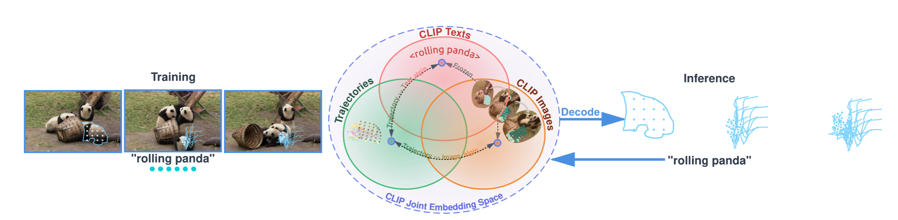
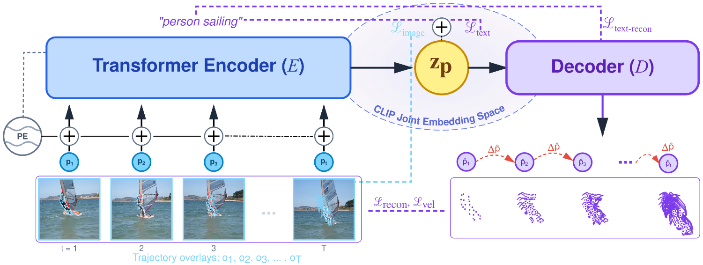
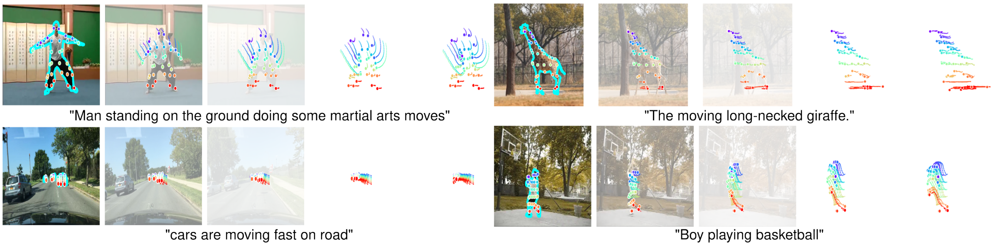
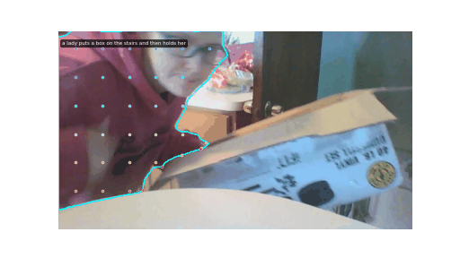
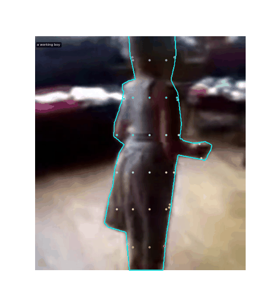

# Lang2Motion

Lang2Motion is a framework for language-guided point trajectory generation by aligning motion manifolds with joint embedding spaces. Unlike prior work focusing on human motion or video synthesis, we generate explicit trajectories for arbitrary objects using motion extracted from real-world videos via point tracking.

## Overview

Lang2Motion learns trajectory representations through dual supervision: textual motion descriptions and rendered trajectory visualizations, both mapped through CLIP's frozen encoders. Our transformer-based auto-encoder supports multiple decoder architectures including autoregressive and MLP variants.

## Key Results

- **Text-to-Trajectory Retrieval**: 34.2% Recall@1, outperforming video-based methods by 12.5 points
- **Motion Accuracy**: 33-52% improvement (12.4 ADE vs 18.3-25.3) compared to video generation baselines
- **Action Recognition**: 88.3% Top-1 accuracy on human actions despite training on diverse object motions
- **Applications**: Style transfer, semantic interpolation, and latent-space editing through CLIP-aligned representations

## Architecture

- **Encoder**: Transformer-based motion encoder with point trajectory inputs
- **Decoder Options**:
  - **Transformer Autoregressive**: Sequential generation with causal attention
  - **MLP**: Direct mapping from latent to trajectories
- **CLIP Integration**: Dual supervision through text and trajectory visualizations
- **Loss Functions**: Reconstruction, velocity consistency, and cosine similarity alignment

---

## 🎨 Visualizations

### Framework Overview
<div align="center">

</div>

### Method Architecture
<div align="center">

</div>

### Teaser Results
<div align="center">

</div>

### Motion Generation Examples

| Text Prompt | Generated Motion |
|-------------|------------------|
| "A person walking forward" |  |
| "A car turning left" |  |
| "A ball bouncing" |  |

---

## 🚀 Quick Start

### Installation

```bash
# Clone the repository
git clone git@bitbucket.org:aclabneu/lang2motion.git
cd lang2motion

# Install dependencies
conda env create -f environment.yml
conda activate lang2motion
```

### Training

```bash
# Train on MeViS dataset
python train_pointclip.py --dataset MeViS --batch_size 32 --epochs 200
```

### Generation

```bash
# Generate motion from text
python generate.py --text "a person walking forward" --output output.npy
```

## Dataset

Lang2Motion uses point trajectories extracted from real-world videos:
- **Source**: Diverse video datasets with object and human motion
- **Tracking**: Point trajectories extracted via CoTracker3
- **Supervision**: Text descriptions and rendered trajectory visualizations
- **Scope**: Arbitrary objects, not limited to human motion

## Results

- **Text-to-Trajectory Retrieval**: 34.2% Recall@1
- **Motion Accuracy**: 12.4 ADE (vs 18.3-25.3 for video baselines)
- **Action Recognition**: 88.3% Top-1 accuracy (cross-domain transfer)
- **Applications**: Style transfer, semantic interpolation, latent-space editing

## Citation

```bibtex
@article{lang2motion2024,
  title={Lang2Motion: Language-Guided Point Trajectory Generation},
  author={ACLab NEU},
  journal={arXiv preprint},
  year={2024}
}
```

## License

MIT License - see LICENSE file for details.
